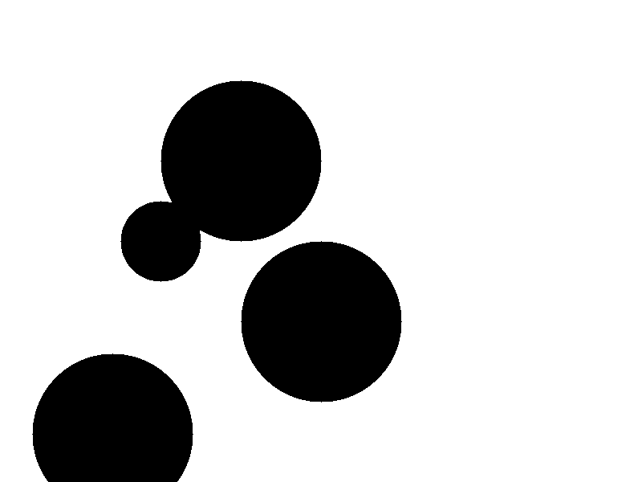
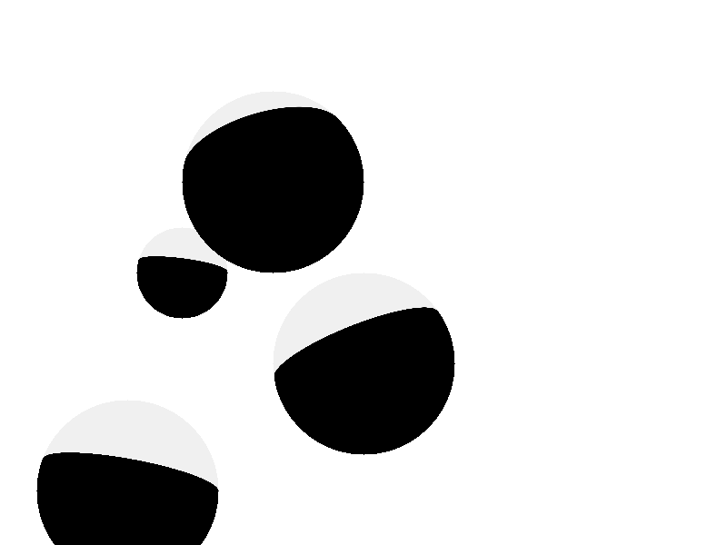
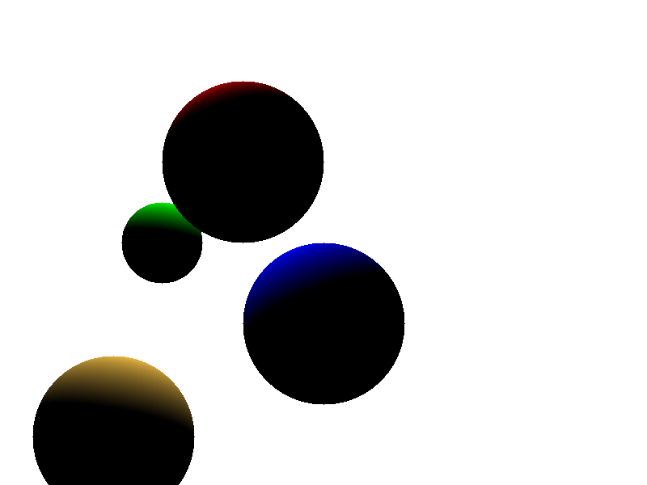
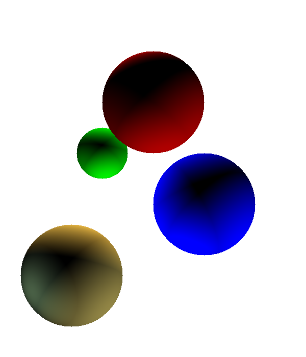
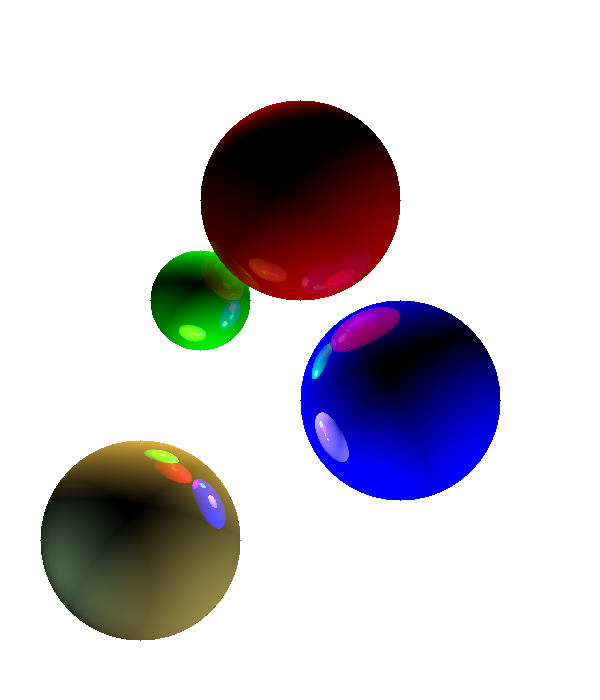

# raytracer

# step 1
* has a ray to sphere intersection detection
* output image to jpeg

# step 2
* add image dimension as input
* add multiple spheres

# step 3
* add a light source and compute lambert lighting
* replace `Vec` with `linear` library for vector maths

# step 4
* add material colours and light sources

# step 5
* add multiple light sources
* add material diffusion

# step 6
* add reflection

